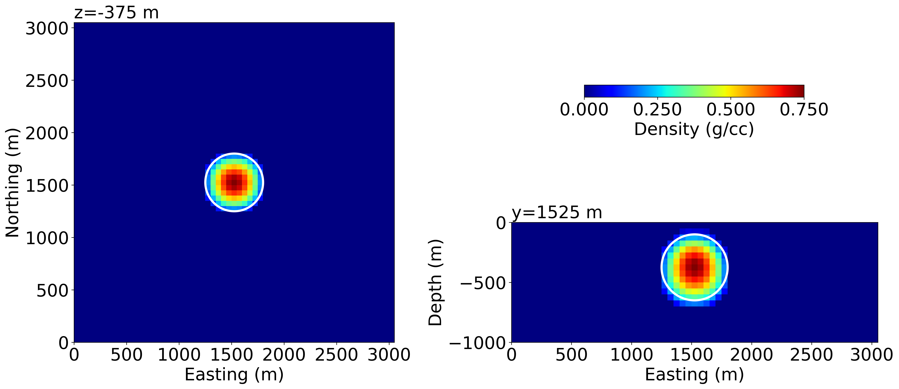

**[summary](#summary) | [contents](#contents) | [usage](#usage) | [running the code](#running-the-code) | [issues](#issues) | [citations](#citations) | [license](#license)**

# 2020 Geophysical Prospecting: sparse model recovering

[](https://doi.org/10.5281/zenodo.4057134)



## Summary

Sparse inversions have proven to be useful for interpreting potential‐field data because the recovered models are characterized by sharp boundaries, compact features and elevated values, compared with conventional smoothness‐based inversion results. However, several open problems remain to be addressed, including the boundary dependence and staircasing problems. The former results in recovered anomalous values being close to the upper bound, while the latter leads to recovered anomalous bodies with either horizontal or vertical boundaries. We have developed a mixed Lp norm regularization strategy to address these two problems. Inversion results based on two synthetic examples confirm the validity of our approach.

## Contents

Introduction of "Input.json" file

- data_file: observed gravity gradient data.

- mesh_file: model discretization or parameterization.

- example: we can select either "spheric" or "horse" to perform inversion using spherical anomaly body or horse shoe shaped model, respectively. And the results (e.g., figures and data) will be stored in the corresponding folders named by the date and time.

- topography: added topography.

- lower_bound and upper_bound: lower and upper bound applied to constraint inversion.

- norm_p: norm value implemented on the smallness component of regularization term.

- norm_q: norm value implemented on the three smoothness componenets of regularization term.

- alpha_s: a constant weighting parameter for smallness component.

- alpha_x: a constant weighting parameter for smoothness component in x direction.

- alpha_y: a constant weighting parameter for smoothness component in y direction.

- alpha_z: a constant weighting parameter for smoothness component in z direction.

Examples

- To reproduce our results, we have created two example folders: Example1_spheric and Example2_horseShoe, that contain the observed data, mesh and topography files. To reproduce the inversion results in Figure 2(a), the Input.json file looks like the following:
```
		"data_file": "gzz.obs",
		"mesh_file": "mesh.txt",
		"example": "spheric",
		"topography": "topo.topo",
		"lower_bound": -1,
		"upper_bound": 0.2,
		"norm_p": 1,
		"norm_q": 2,
		"alpha_s": 1,
		"alpha_x": 0,
		"alpha_y": 0,
		"alpha_z": 0
```

- p=q=2: classic L2 norm inversion (Li and Oldenburg, 1996, 1998)

- p=q=1 or 0: sparse inversion (Farquharson, 2008; Sun and Li, 2014)

- p!=q: mixed Lp norm inversion (Fournier and Oldenburg, 2019)

- alpha_s=0, q=0: focusing inversion (Portniaguine and Zhdanov, 1999)

- alpha_s=0, q=1: total variation inversion (Rudin et al., 1992)

## Usage

To run the script locally, you need to have python installed, [anaconda](https://www.anaconda.com/download/) is recommended.

- Install dependencies:
```
pip install -r requirements.txt
```

- Or, set up working environment using conda:
```
conda env create -f environment.yml
conda activate sparse-environment
```

- Install a modified version of SimPEG. Xiaolong made a few changes, yet haven't pull request so far.
```
pip install git+https://github.com/xiaolongw1223/simpeg.git@Joinv_0.13.0_gzz --upgrade --user
```

## Running the code

Download the code and unzip the file,

- In an IPython console

      run MixedLpInversion.py Input.json

- In a command terminal

      $ python MixedLpInversion.py Input.json

## Issues

Please [make an issue](https://github.com/xiaolongw1223/2020-GP-recovering-sparse-models/issues) if you encounter any problems while trying to run the notebooks.

## Citations

If you use script in your work, please cite:

This article has been accepted for publication and undergone full peer review but has not been through the copyediting, typesetting, pagination and proofreading process, which may lead to differences between this version and the Version of Record. Please cite this article as https://doi.org/10.1111/1365-2478.13063

Cockett, Rowan, Seogi Kang, Lindsey J. Heagy, Adam Pidlisecky, and Douglas W. Oldenburg. "SimPEG: An Open Source Framework for Simulation and Gradient Based Parameter Estimation in Geophysical Applications" Computers & Geosciences, September 2015. https://doi.org/10.1016/j.cageo.2015.09.015.

```
@article{Cockett2015,
author = {Cockett, Rowan and Kang, Seogi and Heagy, Lindsey J. and Pidlisecky, Adam and Oldenburg, Douglas W.},
doi = {10.1016/j.cageo.2015.09.015},
issn = {00983004},
journal = {Computers and Geosciences},
keywords = {Electromagnetics,Geophysics,Inversion,Numerical modeling,Object-oriented programming,Sensitivities},
pages = {142--154},
publisher = {Elsevier},
title = {{SimPEG: An open source framework for simulation and gradient based parameter estimation in geophysical applications}},
url = {http://dx.doi.org/10.1016/j.cageo.2015.09.015},
volume = {85},
year = {2015}
}
```

## License
This script is licensed under the [MIT License](/LICENSE) which allows academic and commercial re-use and adaptation of this work.
